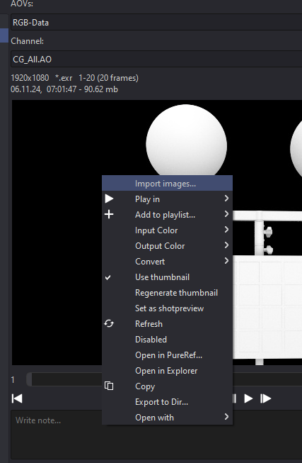
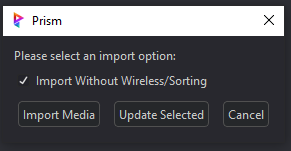
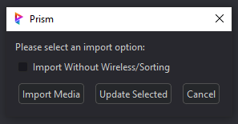
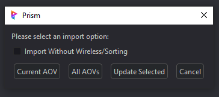
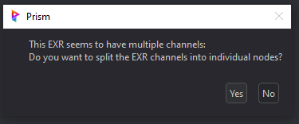
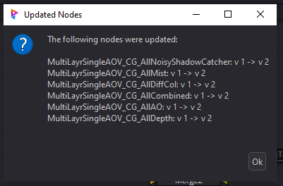

# **Importing**
Importing images into Fusion can be done utilizing the native method by drag/dropping of course.  But the Prism integration provides a better process utilizing the Project Browser.

To import into Fusion first launch the Project Browser from the Prism menu in Fusion, and right click on the image in the viewer.

Depending on the type of image file (video file, image sequence, still image) various options will be displayed allowing the user to import as desired (see sections below).

### **Positioning:**
By default, the image import will try and position all Loaders to the left side of the Comp and stack them vertically to stay uncluttered (see "Import Without Wireless/Sorting" below to disable).

### **Import Without Wireless/Sorting:**

By default, this checkbox is unchecked and will provide additional automation to the import.  The automation will consist of positioning the Loader in a stack to the left side of the Flow in the Comp, and adds a set of Wireless nodes (In and Out) to the Loader.

By checking this checkbox the auto positioning/stacking will be disabled, and place the Loader into the Flow the native "Fusion" way.  This means if a node is selected, it will add the Loader and connect it to the selected node.  If no node is selected, the Loader will be added to the last clicked position in the Flow.

Also if the checkbox is checked, the auto Wireless nodes will not be added and the Loader will be added alone as a single node.

### **Import Options:**

Depending on the type of image file and file structure, the user will be prompted during the import process.

- **Multiple AOV's:**  If there are multiple AOV's present for the media version, a popup asking to import the "Current AOV" or "All AOV's"

&nbsp;&nbsp;&nbsp;&nbsp;&nbsp;&nbsp;&nbsp;&nbsp;&nbsp;&nbsp;&nbsp;&nbsp;&nbsp;

- **Multi-Channel EXR's:** If the .exr has multiple channels (layers), a popup asking to split the channels into separate Loaders.  This will automatically configure the Loaders channels in Fusion.

&nbsp;&nbsp;&nbsp;&nbsp;&nbsp;&nbsp;&nbsp;&nbsp;&nbsp;&nbsp;&nbsp;&nbsp;&nbsp;

- **"Update Selected":** This will update the version of the Loader(s) and show a popup of which Loaders were changed.

&nbsp;&nbsp;&nbsp;&nbsp;&nbsp;&nbsp;&nbsp;&nbsp;&nbsp;&nbsp;&nbsp;&nbsp;&nbsp;

 

jump to:

[**Interface**](Interface.md)

[**Rendering**](Rendering.md)
