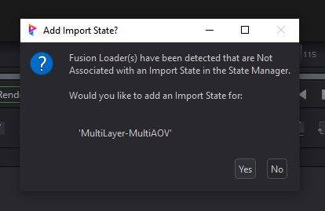

# **Importing 2d Images**
Importing images into Fusion can be done utilizing the native method by drag/dropping of course.  But the Prism integration provides a better process utilizing the State Manager.

To import images into Fusion, select the custom Image Import state in the State Manager.  This will create Loader(s) and cofigure the Loader's frame-range.  If the image contains multiple AOVs or Channels (for multi-layer and multi-part .EXRs), the plugin will create and configure separate Loaders for each and assign the Loader's channels correctly.  The Loaders added to the Comp will be arranged and grouped together with a set of Wireless nodes (see **Positioning** below).  

 

## **Importing:**

Once the "Import Image" button is clicked in the State Manager, a custom Media Browser will be shown to allow the media selection.

There are several ways to select the media:

 - **Double-click Identifier:**  Will load and import the latest version of the entire Identifier.  This means that the State will find the highest version of the Media, and will create and configure Loaders in the Comp for each AOV/Channel.  This is considered the main way to import Media.

 - **Double-click Version:**  Will load the selected version into the State without creating a Loader at this point.  The image structure will be loaded into the State and displayed in the AOV/Channel list.  The user can then choose which AOV/Channels of this version are desired to import.  This is useful if a user wants to import only certain AOVs and/or passes.  

 - **Multi-selection:**  A user may select multiple Identifiers at once, and the import will create a new separate Import Image State for each Identifier.  Each of these states will import the entire Latest version of each Identifier the same way as double-clicking the Identifier.  This allows for fast bulk importing.  To import a multi-selection, first select the desired Identifiers.  And then either right-click and select "Import into Comp", or click the "Import Selected" button at the bottom-right (see below).

 - **"Import Selected" Button:** Pressing the Import Selected button (bottom right) will function differently depending on what is currently selected:
    - Single Identifier:  the same as "Double-click Identifier" above.
    - Single Version:  the same as "Double-click Version" above.
    - Multiple Identifiers:  the same as "Multi-selection" above.

 

## **AOV/Channel List:**

 &nbsp;&nbsp;&nbsp;&nbsp;&nbsp;

The AOV list displays the Media Identifer structure for the currently selected version.  This means that it will display all the AOVs of the version (if there are any), each channel for .EXR images (if there are any), and the frame range.  This gives the user an overview of the image-structure, and allows the user to choose specific parts of the image to import if desired.  

  

## **State Functions:**

 **"Select Version"**:  This will open the MediaBrowser to allow the user to select a specific version of the Media Identifier.  This can be used for comparing versions, or manually upgrading/downgrading the version.

 **"Import Latest Version"**:  This will load and import the highest version of the media (the same as double-clicking the Identifier as above).

 **"Auto-Load Latest Version"**:  This will automatically load and import the highest version, and auto-load the highest verion each time the Comp is opened.

 **"Import All"**:  This will create and configure Loaders for every AOV/Channel of the currently selected/viewed version.

 **"Import Selected"**:  This will create and configure Loaders for only the currently selected AOV/Channels in the AOV list.

 **"Refresh"**:  This will only refresh the UI of the state which can be usueful to update the Loader status color-coding.

  

## **Status Coloring:**

The Image Import State has coloring to display the status of the import.

    - Green:  Loader and selected version both match the Latest (highest) version.
    - Yellow: Loader matches the selected version, but there is a more recent version available.
    - Orange: Loader does match the selected version.
    - Red: Loader associated with the State is missing from the Comp.

  

## **Thumbnails:**

 &nbsp;&nbsp;&nbsp;&nbsp;&nbsp; 

Each State will have a thumbnail generated and displayed at the top of the State.  The plugin will try to find the first "beauty" pass (or color, diffuse, etc) to use as the displayed thumbnail.  If enabled, each AOV/Channel will have a thumbnail generated and can be viewed by hovering over the channel in the AOV List.  Depending on the user-selected thumbnail mode (see [**Interface**](Interface.md)), multi-layer and multi-channel .EXRs will have each channel generated.

    Note: Even though thumbnail creation is multi-threaded, the "All" thumbnail mode in the DCC settings can sometimes cause slower State creation performace for multi-layer / multi-part EXR images.  Using "Simple" or "Disabled" modes will increase State creation performance.  The "Simple" mode will use the default Prism thumbnail (much faster), but the top State thumbnail and all of the channel thumbnails (if multi layer/part) will be the same.

 

## **Update Popup:**

When an image has been updated, a popup window will display detailing the changes.  This can be disabled in the DCC settings (see [**Interface**](Interface.md)).

 

## **Positioning:**

Depending on the user selection in the DCC settings (see [**Interface**](Interface.md)), the image import adds some UI / ease of use functionality when images are imported to the Comp:

### **Sorting:**
If sorting is enabled, the plugin will try and position all Loaders added via the State Mananger to the left side of the Comp and stack them vertically in groups to keep the flow node-graph uncluttered.

### **Wireless:**
If wireless is enabled, a set of Wireless tools are added to each Loader.  The Wireless_In is an Auto-domain tool that is directly connected to the Loader, and the Wireless_Out is a Wireless tool linked to the Wireless_In.  This set-up allows for an single extra Tool to be placed in between the Loader and the Wireless_In (such as a CST, OCIO, Scale, etc).  This extra tool will become part of that Loader's setup, and will be respected when auto-sorting the Loaders.  A user can then either manually move the Wireless_Out to be used in the Flow, or create linked copies of it.

### **Disabled:**
When disabled each selected AOV/Channel will still be imported with separate Loaders and configured, but the Loader's positioning will be the "native Fusion" way.  This means that the Loader will be positioned at the last-clicked position in the Node-graph and automatically connected to any selected Tools (if applicable).

 

## **Utility Functions:**

### **Task Coloring:**

Selecting a color from the dropdown will apply the color to the Fusion Tools in the Comp based on the user preferences in the Prism Settings (see [**Interface**](Interface.md)).  This allows the user to visually associate the Tools in the Comp with the Import State and aids in organization.  The color can be cleared and reset to the default color by selecting "Clear Color".

    Note: the colors themselves are from Fusion's coloring and cannot be edited.

### **Focus View:**

This will center the view of the Fusion node graph to the imported tools.

### **Select Tools:**

This allows the user to quickly select all the Tools that are associated with the Import State. This can be helpful in finding the Loader in a large comp, or to quickly see the flow.

 

## **Scanning for Orphaned Prism Loaders:**

If enabled in the DCC settings, the plugin has the ability to automatically create new Image Import States for discovered Prism Loaders when opening the State Manager inside Fusion.  This works by scanning the Comp and searching for Prism Loaders (Loaders created by a Prism Import Import Image State) that are not associated with an existing Import Image State.  If any orphaned Loaders are discovered, a new Image Import State will be created based on the preferences in the DCC Settings (see [**Interface**](Interface.md)).  The Loader(s) will be updated with new data for the current project/shot/asset etc.

This can be useful if a user needs to move a Import Image State from one Comp into another.

    *** Please note for the plugin to find Loaders for auto-state creation, the Loader must have been created through the Prism Fusion plugin.  This is because the plugin adds specific metadata to the Loader Tool in the Comp that is used for various Prism functions.  Manually adding a Loader into the Comp (or pasteing a Loader) from outside the Prism plugin will not have an Import State in the State Manager and not have the same functionality as above.

___
jump to:

[**Interface**](Interface.md)

[**Rendering**](Rendering.md)

[**Importing 3D**](Importing_3d.md)
