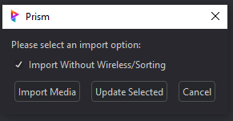
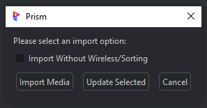
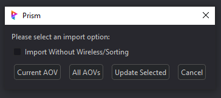
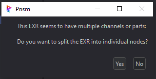
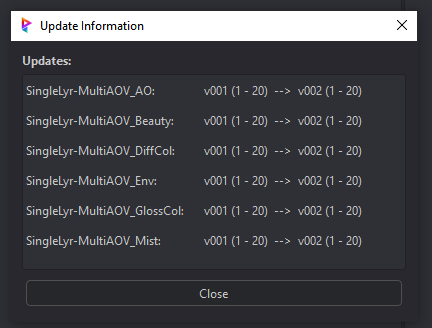
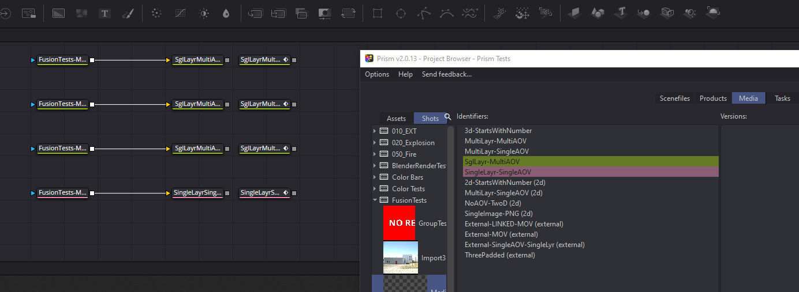
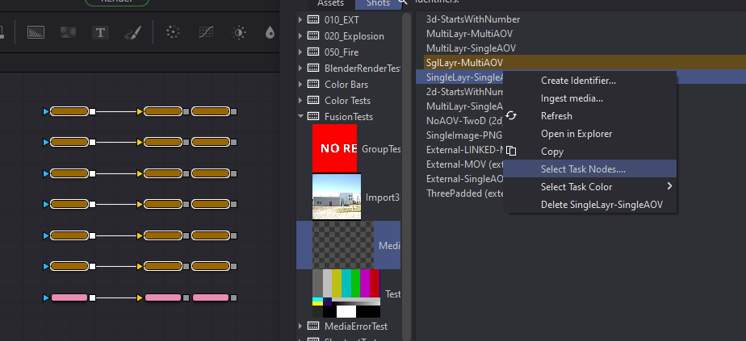

# **Importing 2d Images**
Importing images into Fusion can be done utilizing the native method by drag/dropping of course.  But the Prism integration provides a better process utilizing the Project Browser.

To import into Fusion first launch the Project Browser from the Prism menu in Fusion, and right click on the image in the viewer.

    Note:  importing images through the State Manager is planned in the near future.

Depending on the type of image file (video file, image sequence, still image) various options will be displayed allowing the user to import as desired (see sections below).

### **Positioning:**
By default, the image import will try and position all Loaders to the left side of the Comp and stack them vertically to keep the flow node-graph uncluttered (see "Import Without Wireless/Sorting" below to disable).

### **Import Without Wireless/Sorting:**

By default, this checkbox is unchecked and will provide additional automation to the import.  The automation will consist of positioning the Loader in a stack to the left side of the Flow in the Comp, and adds a set of Wireless nodes (In and Out) to the Loader.

By checking this option the auto positioning/stacking will be disabled, and place the Loader into the Flow the native "Fusion" way.  This means if a node is selected, it will add the Loader and connect it to the selected node.  If no node is selected, the Loader will be added to the last clicked position in the Flow.

In addition to the positioning being disabled, the auto Wireless nodes will not be added and the Loader will be added alone as a single node.

 

---

### **Import Options:**

Depending on the type of image file and file structure, the user will be prompted during the import process.

- **Multiple AOV's:**  If there are multiple AOV's present for the media version, a popup asking to import the "Current AOV" or "All AOV's"

&nbsp;&nbsp;&nbsp;&nbsp;&nbsp;&nbsp;&nbsp;&nbsp;&nbsp;&nbsp;&nbsp;&nbsp;&nbsp;

- **Multi-Channel EXR's:** If the .exr has multiple channels (layers), a popup asking to split the channels into separate Loaders.  This will automatically configure the Loaders channels in Fusion.

&nbsp;&nbsp;&nbsp;&nbsp;&nbsp;&nbsp;&nbsp;&nbsp;&nbsp;&nbsp;&nbsp;&nbsp;&nbsp;

- **"Update Selected":** This will update the version of the Loader(s) and show a popup of which Loaders were changed.

&nbsp;&nbsp;&nbsp;&nbsp;&nbsp;&nbsp;&nbsp;&nbsp;&nbsp;&nbsp;&nbsp;&nbsp;&nbsp;

 

## **Task Coloring / Selecting:**

The Fusion plugin adds additional UI functions to the Media Tab in Prism's Project Browser.  After importing images into Fusion, a user may select a color to be associated with the Media Identifier.

Task coloring and selecting can be accessed by right-clicking the Media Identifier which brings up the context menu.  There are two new items in the menu:

**Select Task Color:**

Selecting a color from the dropdown menu will apply the color to the Task Identifier, and the Fusion Tools in the Comp based on the user preferences in the Prism Settings (see [**Interface**](Interface.md)).  This allows the user to visually associate the Tools in the Comp with the Media ID and aids in organization.  The color can be cleared and reset to the default color by selecting "Clear Color" from the list.

    Note: the colors themselves are from Fusion's coloring and cannot be edited.

 

**Select Task Nodes:**

This allows the user to quickly select all the Tools that are associated with the Media Identifier.  This can be helpful in finding the Loader in a large comp, or to quickly see the flow.

 

___
jump to:

[**Interface**](Interface.md)

[**Rendering**](Rendering.md)

[**Importing 3D**](Importing_3d.md)