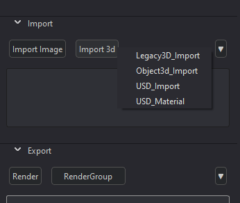
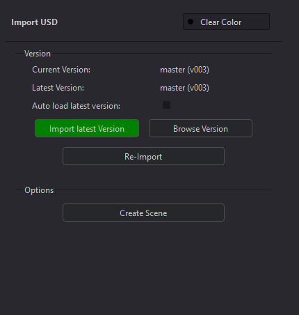
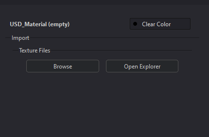
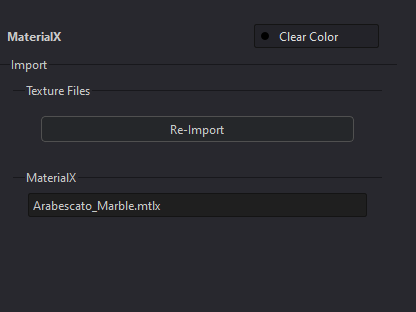
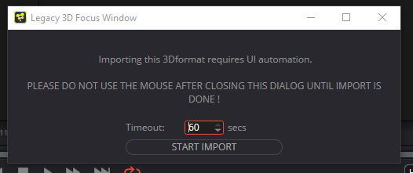
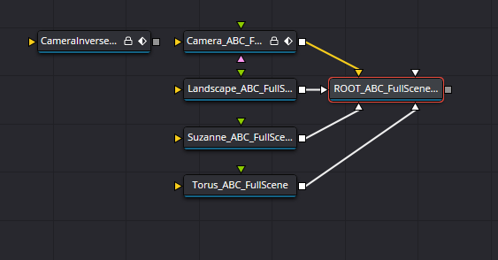
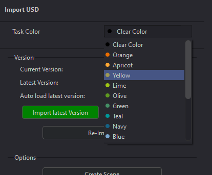

# **Importing 3d**
The Fusion integration adds the ability to import various type of 3D objects and scenes into a Comp.  Importing 3D is done using Prism's State Manager similar to other DCC's.  Custom Import States are included with the Fusion Integration.

 

## **USD Import -- "USD_Import" state**
USD in Fusion is a relatively new addition starting in v18, and the USD toolset in Fusion is not complete.  USD importing from Prism is provided by the "USD_Import" state in the State Manager.  Adding this state will open Prism's Product Browser to allow the user to select the USD file to import, and will create a "uLoader" tool in the Comp, and configure the filepath.

This state functions similar to other Prism import states, and will have coloring to notify the user of the version status where orange means Prism has a more recent version than is currently in the Comp, while green means the most recent version is loaded.

 

## **USD Material -- "USD_Material" state**
This Fusion integration adds a state named "USD_Material" that allows the user to add a MaterialX file, or a texture set into Fusion.  The state will be empty when added, and the user can select the relavent file(s) by either clicking the "Open Explorer" or the "Browse" button if the Prism Libraries plugin is installed.

### **MaterialX**:
If a MaterialX file (.mtlx) is selected, a uMaterialX tool is added to the Comp with the filepath configured.  

### **USD Material**:

## **USD Limitations**
USD in Fusion is a relatively new addition starting in v18, and there are several limitations as of v19.1:
- There is no USD export in the integration.  The Fusion API has no access to the USD Export tool.
- A user cannot manipulate uTextures, which creates many limitations in itself.

 

## **FBX / ABC Import -- "Object3d_Import" state**
The Fusion integration allows the importing of .fbx and .abc objects into a Comp using the "Object3d_Import" state.  This state is used for individual objects, and due to Fusion's scripting limitations, and will not work for camera objects (for cameras see "FBX / ABC Scene Import" below).  

 

## **FBX / ABC Scene Import -- "Legacy3D_Import" state**
Due to Fusion importing limitations (as of v19.1), the only way to import 3D cameras from outside DCC's is using the import "Alembic Scene" and "FBX Scene" in the File menu (except USD cameras).

This state is to be used to import a "3D Scene" into Fusion which may include cameras, lights, and animations.  This state requires UI automation that will call the correct actions, and fill-in the filepaths to the 3D scene file. 

After selecting the Legacy3D_Import state, the Product Browser will open to select the 3D scene to import.  After selecting the scene by double-clicking the Product, and pop-up window will be displayed to notify the user that the automation process is about to start.  It is important that the mouse/keyboard is not touched after the "Start Import" button is pushed until the import is complete and the State Manager is shown again.

Fusion will create the various tools in the Comp for the camera, geometry, and materials as needed.  These will all be connected to a "Root" merge3d tool that should be treated as the output of the import.  A "Create Render Node" button is provided in the State UI that will add a Render3d tool and connect it to the Root node if desired.

Updating/Changing the version of the Imported 3D scene is done the same way as other imports, and will re-configure the Fusion tools to use the new version.

* Please note:  changing/modifying/adding tools into this block of tools could affect the version-handling using Prism's State Manager.  

 

## **Task Coloring:**

The Fusion plugin adds additional UI functions to the Import States to allow the user to select a color to be associated with the Import.

Selecting a color from the dropdown menu will apply the color to the Fusion Tools in the Comp based on the user preferences in the Prism Settings (see [**Interface**](Interface.md)).  This allows the user to visually associate the Tools in the Comp with Import State and aids in organization.  The color can be cleared and reset to the default color by selecting "Clear Color" from the list.

* Note: the colors themselves are from Fusion's coloring and cannot be edited.

 

## **Options:**
Many of the States have similar options:

### **Create Scene**:
This will add either a USD or legacy 3D Merge tool and Render tool to the Comp, and connect it to the imported 3D tools.  This can be a quick way to 

 

___
jump to:

[**Interface**](Interface.md)

[**Rendering**](Rendering.md)

[**Importing Images**](Importing_2d.md)
