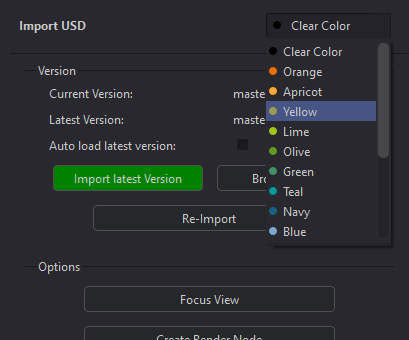

# **Importing 3d**
The Fusion integration adds the ability to import various type of 3D objects and scenes into a Comp.  Importing 3D is done using Prism's State Manager similar to other DCC's.  Custom Import States are included with the Fusion Integration.

 

## **USD Import -- "USD_Import" state**
USD in Fusion is a relatively new addition starting in v18, and the USD toolset in Fusion is not complete.  USD importing from Prism is provided by the "USD_Import" state in the State Manager.  Adding this state will open Prism's Product Browser to allow the user to select the USD file to import, and will create a "uLoader" tool in the Comp, and configure the filepath.

This state functions similar to other Prism import states, and has button-coloring to notify the user of the version status where orange means Prism has a more recent version than is currently in the Comp, while green means the most recent version is loaded.

 

## **USD Material -- "USD_Material" state**
This Fusion integration adds a state named "USD_Material" that allows the user to add a MaterialX file, or an image texture set into Fusion.  The state will be empty when added, and the user can select the relevant file(s) by either clicking the "Open Explorer" or the "Browse" button if the Prism Libraries plugin is installed **.

    If the Prism Libraries is installed, MatX files and texture sets can be imported from the online libraries (Poly Haven, GPU Open) by double-clicking the thumbnail.

### **MaterialX (.mtlx)**:
If a MaterialX (.mtlx) file is selected, a uMaterialX tool is added to the Comp with the filepath configured.  

### **USD Material (texture set)**:
When an image-texture set is selected by the user (through the "Browse" or "Open Explorer" buttons), the plugin attempts to select all the files for the various passes (ie diff color, rough, normal, etc) and will list them in the texture list box.

    * If the plugin is not picking up all of the texture files in the set, a user can browse to the files and multi-select the files to force them into the texture list

#### **Configuring**:
Once the image-texture files have been added to the texture box, the plugin attempts to configure the pass-type based on the file naming. This should work for most industry-standard naming conventions, but if a user needs to change the pass-type, each texture file has a dropdown on its left side to configure the pass type that will be used for the USD material.  Selecting "NONE" or removing the file from the list (see "Right-Click" below) will not include the file in the import.

    * Note:  as of Fusion v19.1 there is not a way to manipulate USD textures (uTexture tool) to be able to use channel-packed textures (ie ARM: AO, Roughness, metalness).  Thus importing ARM (packed) files will result in the file not being connected to the shader.

#### **Right-Click**:
The texture list has a custom right-click menu.  If a user right-clicks on one or more items, the option to remove the texture(s) is available.  Or if an empty area is right-clicked, the option to clear the list is available.

#### **Create Material**:
Once the texture files have been configured, clicking the "Create Material" button will add a tool-group to the Comp that contains the uTextures and a uShader.  A user may manipulate the uShader by opening the group and making changes as desired.

## **USD Limitations**
USD in Fusion is a relatively new addition starting in v18, and there are several limitations as of v19.1:

    - There is no USD export in the integration.  The Fusion API has no access to the USD Export tool.
    - A user cannot manipulate uTextures (image textures) nor manipulate the UV's, which creates many limitations in itself.

 

## **FBX / ABC Import -- "Object3d_Import" state**
The Fusion integration allows the importing of .fbx and .abc objects into a Comp using the "Object3d_Import" state.  This state is used for individual objects, and functions similar to the USD Import State.  Due to Fusion's scripting limitations, this state will not work for camera objects (for Cameras see "FBX / ABC Scene Import" below).  

 

## **FBX / ABC Scene Import -- "Legacy3D_Import" state**
Due to Fusion's importing limitations (as of v19.1), the only way to import 3D cameras from outside DCC's is using the import "Alembic Scene" and "FBX Scene" in Fusion's File menu (except USD cameras).

This state is to be used to import a "3D Scene" into Fusion which may include cameras, lights, and animations.  This state requires UI automation that will call the correct actions, and fill-in the filepaths to the 3D scene file. 

After selecting the Legacy3D_Import state, the Product Browser will open to select the 3D scene to import.  After selecting the scene by double-clicking the Product, and pop-up window will be displayed to notify the user that the automation process is about to start.  It is important that the mouse/keyboard is not touched after the "Start Import" button is pushed until the import is complete and the State Manager is shown again.

Fusion will create the various tools in the Comp for the camera, geometry, and materials as needed.  These will all be connected to a "Root" merge3d tool that should be treated as the output point of the import.  A "Create Render Node" button is provided in the State UI that will add a Render3d tool and connect it to the Root node if desired.

Updating/Changing the version of the Imported 3D scene is done the same way as other imports, and will re-configure the Fusion tools to use the new version.

* Please note:  changing/modifying/adding tools into this block of tools could affect the version-handling using Prism's State Manager.  

 

## **Deleting States:**
Deleting states is similar to other DCC integrtions where a user right-clicks the State and selects Delete.  If the corresponding tools exist in the Comp, a popup will be shown asking if the Tools should be removed from the Comp.  If declined, the State will be removed but the Tools will remain in the Comp.

 

## **Task Coloring:**

The Fusion plugin adds additional UI functions to the Import States to allow the user to select a color to be associated with the Import.

Selecting a color from the dropdown menu will apply the color to the Fusion Tools in the Comp based on the user preferences in the Prism Settings (see [**Interface**](Interface.md)).  This allows the user to visually associate the Tools in the Comp with Import State and aids in organization.  The color can be cleared and reset to the default color by selecting "Clear Color" from the list.

    * Note: the colors themselves are from Fusion's coloring and cannot be edited.

 

## **Options:**
Many of the States have similar options:

### **Import Latest Version**:
This will update the imported tools to the most recent version.

### **Browse Version**:
This will open the Product Browser to allow the user to choose a specific version, and update the tools.

### **Re-Import**:
This will "refresh" the importd tools, for situtions when there have been changes made to the import file.  If the tools have been removed from the Comp, this will re-add the tools.

### **Focus View**:
This will center the view of the Fusion node graph to the imported tools.

### **Create Render Node**:
This will add either a USD or legacy 3D Merge tool and Render tool to the Comp, and connect it to the imported 3D tools.

 

___
jump to:

[**Interface**](Interface.md)

[**Rendering**](Rendering.md)

[**Importing Images**](Importing_2d.md)
