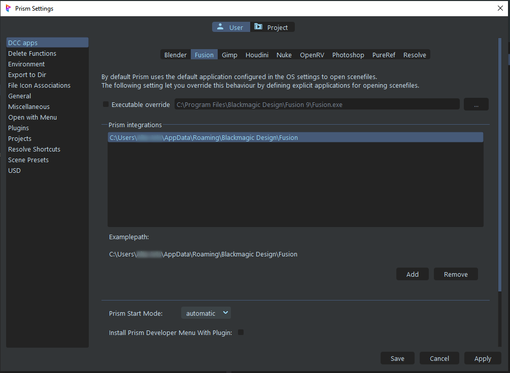

# **Installation**

 

Copy the directory named "Fusion" to a directory of your choice, or a Prism2 plugin directory.

It is suggested to have the Fusion plugin with the other DCC plugins in: *{drive}\ProgramData\Prism2\plugins*

Prism's default plugin directories are: *{installation path}\Plugins\Apps* and *{installation Path}\Plugins\Custom*.

You can add the additional plugin search paths in Prism2 settings.  Go to Settings->Plugins and click the gear icon.  This opens a dialogue and you may add additional search paths at the bottom.

Once added, select the "Add existing plugin" (plus icon) and navigate to where you saved the Fusion folder.

 

Afterwards, you can select the Plugin autoload as desired:

To add the integration, go to the "DCC Apps" -> "Fusion" tab.  Then click the "add" button and navigate to the folder containing Fusion's "Scripts" directory - this is usually at "../AppData/Roaming/Blackmagic Design/Fusion".  If there is more than one version of Fusion installed, it is advisable to set the executable in the "Override" box in the DCC settings.

 

jump to:

[**Interface**](Interface.md)

[**Rendering**](Rendering.md)

[**Importing Images**](Importing_2d.md)

[**Importing 3D**](Importing_3d.md)