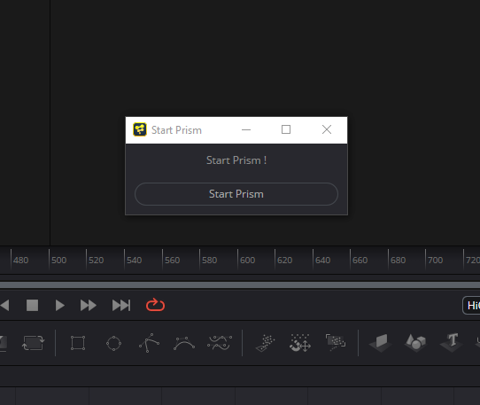
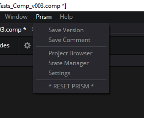
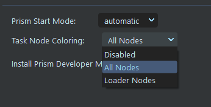
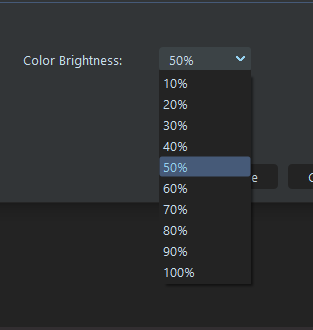

# **Interface**
 

## **Prism Startup Mode:**

 

There are three modes for Prism launching in Fusion: "Automatic", "Prompt", and "Manual".  The desired behaviour can be selected in the "DCC apps" tab of the Prism User Settings.

### **- Automatic**

When in Automatic mode, Prism will be launched everytime Fusion is started.
 

### **- Prompt**

When in Prompt mode, a popup will display to allow the user to launch the Prism when Fusion is started.

### **- Manual**

When in Manual mode, Prism will not start when Fusion is opened.  But Prism can be started anytime by using the "RESET PRISM" button in the Prism menu.

 

## **Prism Menu:**

 

Prism functions are accessed through the Prism menu in the top bar of Fusion Studio's UI.  The menu will look familiar to Prism users and contain the normal Prism functions.

The Prism functions are running in a dedicated process, so note that only one Prism Fusion window can be open at a time.  For example, if a user has the State Manager open through Fusion, it must be closed before the Project Browser may be opened.

### **Menu Options:**

- **Save Version:** Captures a thumbnail from the Comp and saves it to a new incremented version in Prism's project structure.

- **Save Comment:**  Opens a dialogue to allow the user to enter a comment and/or description of the new version.  It also allows the user to select a screenshot to be used for the thumbnail.  It then saves to a new version as above.

- **Project Browser:**  Launches the Prism Project Browser.  This allows the user to import images into Fusion from the Prism project (see [**Importing Images**](Importing_2d.md)).

- **State Manager:**  Launches the Prism State Manager.  This allows the user to render images into the Prism project structure (see [**Rendering**](Rendering.md)) and import 3d objects (see [**Import 3D**](Importing_3d.md)).

- **Settings:**  Launches the Prism Settings window.

- **RESET PRISM:**  will restart/reload the Prism Functions inside of Fusion, and can be used if there are any glitches with Prism while Fusion is open.  This can also be used to start Prism if the startup dialogue was not used when Fusion was opened.

 

## **Task Coloring:**

The Fusion plugin adds additional UI functions to the Media Tab of the Project Browser to allow the user to add a color to a Media Identifier and Loaders (see [**Importing Images**](Importing_2d.md)).

Configuration of this behaviour is in the Prism Settings
 

### **Mode**

- **Disabled:**     Coloring functions are disabled
- **All Nodes:**    Both the Loader and associated Wireless nodes will be colored
- **Loader Nodes:** Only the Loader node will be colored
 

### **Brightness**

This setting allows the user to set the "brightness" of the background color of colored tasks.  

 

## **Fusion AutoSave:**

Fusion has a native auto-save function that will periodically save the Comp to a temp file in the same directory as the original Comp.  This file with have an extension of ".autocomp", and is displayed in Prism's Project Browser with a custom icon.

 

___
jump to:

[**Rendering**](Rendering.md)

[**Importing Images**](Importing_2d.md)

[**Importing 3D**](Importing_3d.md)
