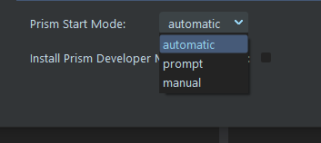

# **Interface**

## **Prism Menu:**

 

Prism functions are accessed through the Prism menu in the top bar of Fusion Studio's UI.  The menu will look familiar to Prism users and contains the normal Prism functions.

    The Prism functions are running in a dedicated process, so note that only one Prism Fusion window can be open at a time.  For example, if a user has the State Manager open through Fusion, it must be closed before the Project Browser may be opened.

### **Menu Options:**

- **Save Version:** Captures a thumbnail from the Comp and saves it to a new incremented version in Prism's project structure.

- **Save Comment:**  Opens a dialogue to allow the user to enter a comment and/or description of the new version.  It also allows the user to select a screenshot to be used for the thumbnail.  It then saves to a new version as above.

- **Project Browser:**  Launches the Prism Project Browser.

- **State Manager:**  Launches the Prism State Manager.  This allows the user to render images (see [**Rendering**](Rendering.md)) and import 2d images (see [**Importing Images**](Importing_2d.md)) and 3d objects (see [**Import 3D**](Importing_3d.md)) to/from the Prism project structure.

- **Settings:**  Launches the Prism Settings window.

- **RESET PRISM:**  will restart/reload the Prism Functions inside of Fusion, and can be used if there are any glitches with Prism while Fusion is open.  This can also be used to start Prism if the startup dialogue was not used when Fusion was opened.

 

## **Settings:**

The Fusion plugin has several functions that are user configurable from the Prism User-->DCC-->Fusion settings tab.

 

### **Prism Startup Mode:**

There are three modes for Prism launching in Fusion: "Automatic", "Prompt", and "Manual".

#### **- Automatic**

When in Automatic mode, Prism will be launched everytime Fusion is started.

#### **- Prompt**

When in Prompt mode, a popup will display to allow the user to launch the Prism when Fusion is started.

#### **- Manual**

When in Manual mode, Prism will not start when Fusion is opened.  But Prism can be started anytime by using the "RESET PRISM" button in the Prism menu.

 

### **Task Node Coloring**

- **Disabled:**     Coloring functions are disabled
- **All Nodes:**    Both the Loader and associated Wireless nodes will be colored
- **Loader Nodes:** Only the Loader node will be colored

 

### **Sorting / Wireless**

- **Sorting & Wireless:**     Loaders will be grouped and arranged on the left-side of the Fusion Node-graph, and a set of Wireless tools will be added for each Loader (see [**Importing Images**](Importing_2d.md)).
- **Sorting Only:**    Loaders will be arranged as above, but Wireless tools will not be added.
- **Disabled:**   Loaders will be added to the Node-graph the native Fusion way.  This means they will be added at the last-clicked position and connected to the selected Tool (if applicable).

 

### **AOV/Channel Thumbnails**

- **All:**     Thumbnails will be generated for every image AOV/Channel and .EXR channel/part (see [**Importing Images**](Importing_2d.md)).  Even though the thumbnail generation is threaded, multi-layer and multi-part .EXR thumbnail generation can cause a delay in the import.  Users may choose to not use this option if they want better performance during the import.
- **Simple:**    Thumbnails will be generted as above, but multi-layer and multi-part .EXRs will not have separate thumbnails for each Channel.  This will instead use the Prism thumbnail which will be the first layer/part of the EXR image.  Also, the State thumbnail at the top of the state will use the same "first" thumbnail.
- **Disabled:**   The AOV/Channels in the AOV list will not have thumbnails generated.

 

### **Thumbnail Size**

- Selects the size of the displayed AOV List thumbnails when hovering over the channel.  This does not effect performance much.

 

### **Version Update Popup**

- Allows the user to enable/disable the version update popup after a Media update (see [**Importing Images**](Importing_2d.md)).

 

## **Fusion AutoSave:**

Fusion has a native auto-save function that will periodically save the Comp to a temp file in the same directory as the original Comp.  This file with have an extension of ".autocomp", and is displayed in Prism's Project Browser with a custom icon.

 

___
jump to:

[**Rendering**](Rendering.md)

[**Importing Images**](Importing_2d.md)

[**Importing 3D**](Importing_3d.md)
