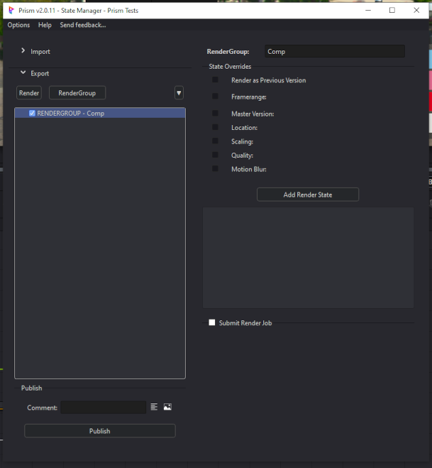
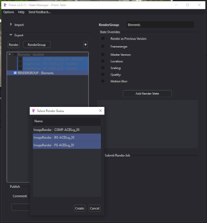
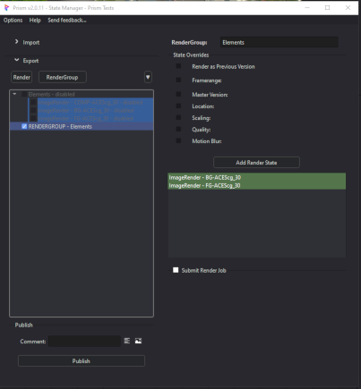
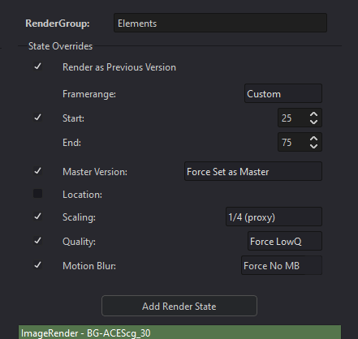

# **Rendering**

 

Prism's State Manager is used for rendering images from Fusion into the Prism pipeline and functions similar to other DCC integrations.

 

## **ImageRender**
  The primary Render State type is "ImageRender" which is accessed using the "Render" button in the State Manager.  This state allows the user to add a Fusion Saver into the Comp and configure its settings.  

Each ImageRender state is linked to its respective Saver tool in the Comp, and the Saver's status is indicated by the coloring of the button.

 

### **Status Color:**
When an ImageRender is initially added to the State Manager, the button is red which indicates that the Saver does not exist in the Comp.  Clicking the red "SetRenderNode" button will add the linked Saver and configure its filepath using Prism's project structure. The button will then turn Green indicating that the Saver is correctly configured and linked to the ImageRender state.

If the state's name does not match the Saver's name (and thus the correct filepath), the button will display Orange. For example, after changing the Identifier name, this will then not match the linked Saver and it will turn Orange.  Clicking the button will then reconfigure the Saver with the new name and the button will display Green.

RED:&nbsp;&nbsp;&nbsp;&nbsp;&nbsp;&nbsp;&nbsp;&nbsp;&nbsp;&nbsp;&nbsp;Saver does not exist 
ORANGE:&nbsp;&nbsp;&nbsp;Saver name does not match the State Identifier 
GREEN:&nbsp;&nbsp;&nbsp;&nbsp;&nbsp;&nbsp;Saver is linked correctly.

 

### **Removing a State:**
To remove a state from the State Manager, a user may right-click the state in the list on the left side of the State Manager.  For convenience, a popup will display asking if the linked Saver should be removed as well.

### **Fusion Naming:**
BlackMagic Fusion has a strict naming scheme for all nodes/tools that affects the naming of the state's Identifier.  If the user-entered Identifier has any "illegal" characters, the name will automatically be made to be "Fusion Legal".

You can only use:
- Alphanumeric characters:  a-z, A-Z, 0-9,
- Do not use any spaces,
- Do not use special characters,
- Name cannot start with a number.

### **Scaling:**
A scale override is provided to allow the user to quickly change the rendered resolution for each state.  This can be useful for quick preview renders.  Scaling is handled automatically using a combination of Fusion's Proxy system (for speed) or a Scale node.

- No override:&nbsp;&nbsp;&nbsp;&nbsp;&nbsp;&nbsp;&nbsp;The Comp resolution will be used
- Scale < 100%:&nbsp;&nbsp;&nbsp;&nbsp;&nbsp;Fusion's Proxy system will be used
- Scale > 100%:&nbsp;&nbsp;&nbsp;&nbsp;&nbsp;A scale tool will be temporally added to the Comp before the Saver

### **Format:**
The Fusion integration allows rendering to many popular image formats.  The "Format" dropdown allows the user to select the format type, and after it is selected the user may config the Saver's various options in the Fusion interface (Inspector) such as codec and compression.

### **Set Output Only:**
This checkbox sets the ImageRender state to not render, which means during a publish the associated Saver's output filepath (including version) will be configured but a render will not be triggered.  This can be useful for some workflows where the Savers need to be configured, but the Render will be executed manually or by outside automation.

When a state is set to Output Only, a blue icon will be displayed next to the State name in the list.

### **Rendering:**
A render is executed the same as other DCC's Prism integrations.  A user can either click the "Publish" button or right-click the state and select "Execute".  Prism will execute one state at a time, and thus Fusion will render one Saver at a time.  This allows single Savers in the Comp to be rendered individually by automatically handling the muting/unmuting of the Savers.

If a user would like to render multiple Savers at once, see the RenderGroup below.

 

## **RenderGroup**
Compositing software workflows differs from other types of DCC software by using image outputs various places throughout the image generation flow, with many workflows requiring rendering multiple output images simultaneously.

The Prism Fusion integration has a state called "RenderGroup" which allows multiple states (and thus multiple Savers) to be rendered at once.  The RenderGroup can save render time and resources, and allow a user to group various Savers into one state.  The RenderGroup can be rendered on the local machine or sent to a render farm (see "Deadline Farm Render" below).

The name of the RenderGroup is just for organization and will not affect the naming or filepath of the Render States.

### **Adding States:**
A RenderGroup contains existing render states.  To add a state to the RenderGroup, click the "Add Render State" button to launch the popup.  The desired state(s) are selected and added to the UI.

The enabled checkbox status of the Render States will not affect the rendering of the State in the RenderGroup.  What this means is that a user can have the various ImageRender states disabled to make sure they do not get rendered during a Publish, but the Rendergroup will still render the states simultaneously.

&nbsp;&nbsp;&nbsp;&nbsp;&nbsp;&nbsp;

### **Removing States:**
To remove a state from the RenderGroup, right-click on the state in the right-side list.  To remove all the states from the RenderGroup, right-click on an empty area in the list and select "Remove All States".

### **Status Color:**
States listed in the RenderGroup will be colored just as the node in the ImageRender to give the user feedback of the status of the associated Saver of the state.

### **Render as Previous Version:**
Checking this box will configure the Saver(s) to use the output filepath of the previous (highest) version.  This allows a user to continuously update a specific version of the media, instead of generating new versions for each publish.

*** Be aware of course that this will overwrite existing files in that version.

### **Overrides:**
Various overrides can be selected for the RenderGroup.  These overrides will apply to the entire Comp and affect all the states that are in the RenderGroup, for the RenderGroup publish.  This means for example a user may have one RenderGroup that renders at the full resolution and quality for a "Final", and have another RenderGroup that is scaled down and lower quality for a "Proxy".  Again, these overrides will only affect the states during the publish of the RenderGroup.

When using a RenderGroup, the render frame range defaults to the Comp's framerange if a framerange override is not selected.  If a framerange override is used, it will apply to all the states in the RenderGroup.

A pre-publish dialogue (sanity check) will inform the user of the various overrides and options that have been selected for the RenderGroup before the render is triggered.

### **Deadline Farm Render:**
If the State Manager "Submit Render Job" is not checked, the RenderGroup will be executed on the local machine.  But if Submit is checked, the RenderGroup will be submitted to Deadline for distributed rendering similar to other DCC's.

For a farm submission this plugin will first save the Comp, and then configure the Comp using any selected overrides.  It will then save the Comp to a temporary directory, which will then be submitted to Deadline.  After the submission, the original Comp will be reloaded without any changes.

Anybody who has used Fusion Studio with Deadline will probably have experienced the various issues such as Fusion version, RenderNode vs Fusion application, Fusion license, etc.  This integration has been designed to work with rendering with both RenderNodes and Fusion Studio.  But the user must make sure that Deadline has been "modified" to work with the version of Fusion being used, as well as handle the "FusionServer" service on the farm machines.  

 

jump to:

[**Interface Docs**](Interface.md)

[**Importing Docs**](Importing.md)