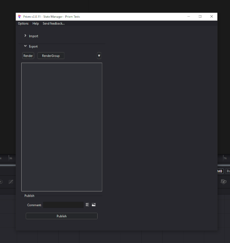
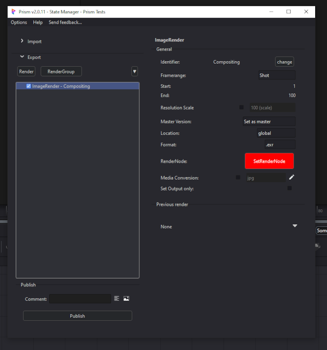
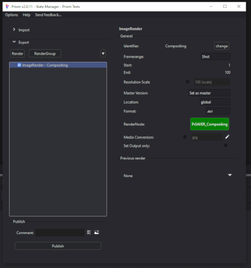
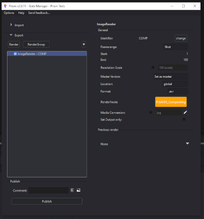

# **Rendering**

 

Prism's State Manager is used for rendering images from Fusion into the Prism pipeline and functions similar to other DCC integrations.

 

## **ImageRender**
  The primary Render State type is "ImageRender" which is accessed using the "Render" button in the State Manager.  This state allows the user to add a Fusion Saver into the Comp and configure its settings.  

Each ImageRender state is linked to its respective Saver tool in the Comp, and the Saver's status is indicated by the coloring of the button.

When an ImageRender is initially added to the State Manager, the button is red which indicates that the Saver does not exist in the Comp.  Clicking the red "SetRenderNode" button will add the linked Saver and configure its filepath using Prism's project structure. The button will then turn Green indicating that the Saver is correctly configured and linked to the ImageRender state.

If the state's name does not match the Saver's name (and thus the correct filepath), the button will display Orange. For example after changing the Identifier name, this will then not match the linked Saver and it will turn Orange.  Clicking the button will then reconfigure the Saver with the new name and the button will display Green.

RED:&nbsp;&nbsp;&nbsp;&nbsp;&nbsp;&nbsp;&nbsp;&nbsp;&nbsp;&nbsp;&nbsp;Saver does not exist 
ORANGE:&nbsp;&nbsp;&nbsp;Saver name does not match the State Identifier 
GREEN:&nbsp;&nbsp;&nbsp;&nbsp;&nbsp;&nbsp;Saver is linked correctly.

 

### **Removing a State:**
To remove a state from the State Manager, a user may right-click the state in the list.  For convience, a popup will display asking if the linked Saver should be removed as well.

### **Fusion Naming:**
Black Magic Fusion has a strict naming scheme for all nodes/tools that affects the naming of the state's Identifier.  If the user-entered Identifier has any "illegal" charactors, the name will automatically be made to be "Fusion Legal".

You can only use:
- Alphanumeric characters:  a-z, A-Z, 0-9,
- Do not use any spaces,
- Do not use special charactors,
- Name cannot start with a number.

### **Scaling:**
A scale override is provided to allow the user to quickly change the rendered resolution for each state.  This can be useful for quick preview renders.  Scaling is handled automatically using a combination of Fusion's Proxy system (for speed) or a Scale node.

- No override:&nbsp;&nbsp;&nbsp;&nbsp;&nbsp;&nbsp;&nbsp;The Comp resolution will be used
- Scale < 100%:&nbsp;&nbsp;&nbsp;&nbsp;&nbsp;Fusion's Proxy system will be used
- Scale > 100%:&nbsp;&nbsp;&nbsp;&nbsp;&nbsp;A scale tool will be temporially added to the Comp before the Saver

### **Format:**
The Fusion integration allows rendering to many popular image formats.  The "Format" dropdown allows the user to select the format type, and after it is selected the user may config the Saver's various options such as codec and compression.

### **Rendering:**
A render is executed the same as other DCC's Prism integrations.  A user can either click the "Publish" button or right-click the state and select "Execute".  Prism will execute one state at a time, and thus Fusion will render one Saver at a time.  This allows single Savers in the Comp to be rendered individually by automaticcly handling the muting/unmuting of the Savers.

If a user would like to render multiple Savers at once, see the RenderGroup below.

 

## **RenderGroup**

 

jump to:

[**Interface**](Docs/Interface.md)

[**Importing**](Docs/Importing.md)